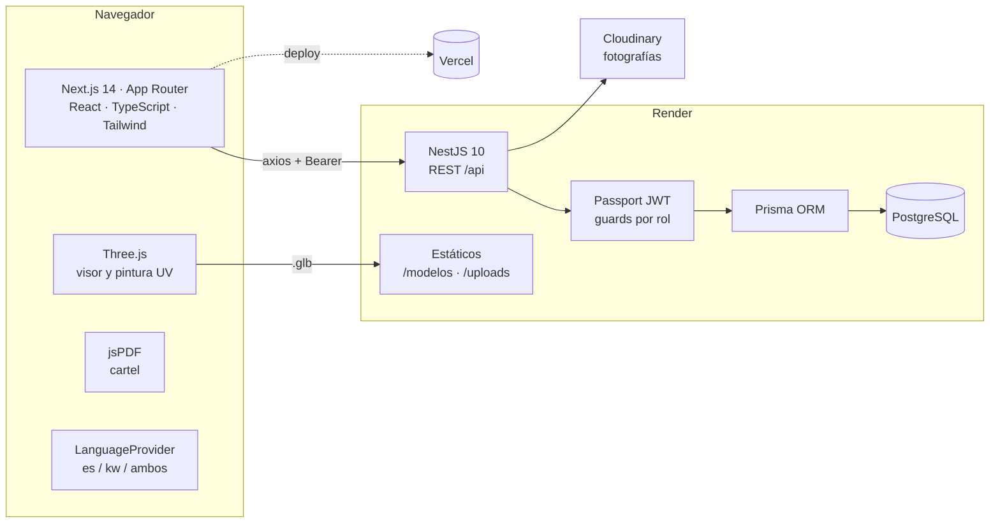
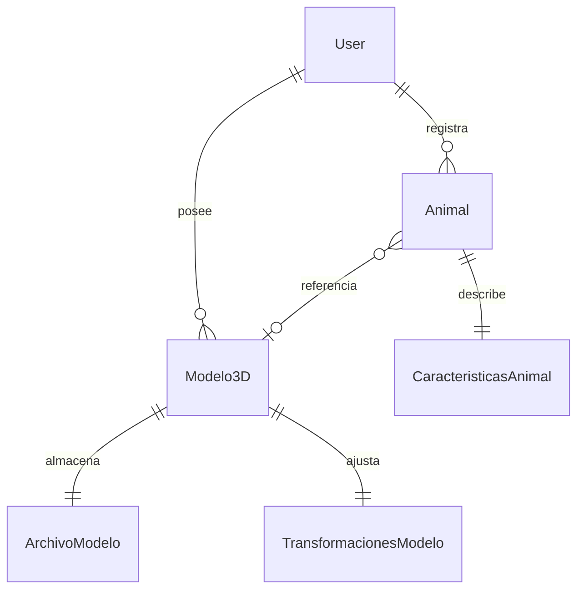

# 2. La solución tecnológica desarrollada

> Rúbrica §2: demostrar el funcionamiento del sistema. Se verificará que las
> funcionalidades principales respondan a la problemática inicialmente
> planteada.

---

## 1. Qué es el sistema

**Wasi Wiwakuna 3D** es una aplicación web que permite a una persona registrar
su mascota perdida, describirla con fotografías reales y con un modelo 3D
pintado a mano con sus señas particulares, indicar una zona aproximada de
último avistamiento sin revelar su domicilio, y exportar un cartel en PDF listo
para difundir. Toda la interfaz funciona en castellano, en kichwa o en ambos a
la vez.

## 2. Arquitectura

Cliente y servidor están separados y se comunican solo por HTTP con JSON y JWT.
Esa separación no es decorativa: permite desplegar el frontend en una CDN y el
backend junto a la base de datos, que es exactamente el despliegue de producción
adoptado.

### Capas y responsabilidades

| Capa | Tecnología | Responsabilidad |
| --- | --- | --- |
| Presentación | Next.js 14 (App Router), React 18, Tailwind CSS | Interfaz, rutas, estado de sesión |
| Internacionalización | `LanguageProvider` + `translations.ts` | Conmutación es / kw / bilingüe en caliente |
| Visualización 3D | Three.js 0.160, GLTFLoader, OBJLoader | Carga de modelos, rotación, zoom, pintura sobre textura |
| Documentos | jsPDF | Generación del cartel |
| API | NestJS 10, class-validator | Endpoints REST bajo el prefijo `/api` |
| Seguridad | Passport JWT, bcrypt, guards de rol | Autenticación y autorización |
| Persistencia | Prisma 5 + PostgreSQL | Modelo de datos y migraciones versionadas |
| Archivos | Sistema de archivos + Cloudinary | Modelos `.glb` estáticos; fotografías en CDN |

El detalle de la separación en capas está en
[docs/ARQUITECTURA_MVC.md](../../docs/ARQUITECTURA_MVC.md).

## 3. Modelo de datos

Ocho entidades, definidas en
[backend/prisma/schema.prisma](../../backend/prisma/schema.prisma) y aplicadas
mediante tres migraciones versionadas.

| Entidad | Para qué existe |
| --- | --- |
| `User` | Cuenta, credencial cifrada con bcrypt, rol `USER` o `ADMIN`, zona |
| `Animal` | Ficha de la mascota, propietario, categoría, estado de publicación |
| `CaracteristicasAnimal` | Color, tamaño, raza y señas descriptivas |
| `Modelo3D` | Modelo asociado a una especie, público o privado, con su dueño |
| `ArchivoModelo` | Ruta, nombre, tipo MIME y tamaño del `.glb`/`.obj` |
| `TransformacionesModelo` | Escala y rotación por eje, para que el modelo se guarde tal como el usuario lo dejó |
| `Role` (enum) | `USER`, `ADMIN` |
| `CategoriaAnimal` (enum) | `PERRO`, `GATO`, `CONEJO` |

## 4. Superficie de la API

Todos los endpoints cuelgan del prefijo `/api`. Los marcados con 🔒 exigen un
JWT válido.

| Método | Ruta | Función |
| --- | --- | --- |
| `POST` | `/api/auth/register` | Crear cuenta |
| `POST` | `/api/auth/login` | Iniciar sesión, devuelve JWT |
| `GET` | `/api/users/profile` 🔒 | Perfil del usuario autenticado |
| `PUT` | `/api/users/profile` 🔒 | Actualizar perfil |
| `GET` | `/api/animales/publicos` | Catálogo público, sin sesión |
| `GET` | `/api/animales/mios` 🔒 | Solo las mascotas del usuario |
| `GET` | `/api/animales` 🔒 | Todas — reservado a `ADMIN` |
| `GET` | `/api/animales/:id` | Ficha individual |
| `POST` `PUT` `DELETE` | `/api/animales[/:id]` 🔒 | Alta, edición y baja, con verificación de propiedad |
| `GET` | `/api/modelos3d/catalogo/:categoria` | Modelos filtrados por especie |
| `POST` | `/api/modelos3d/upload` 🔒 | Subir un modelo propio |
| `POST` | `/api/modelos3d/:id/derivar` 🔒 | Crear una copia personalizada sin alterar el original |
| `POST` | `/api/uploads/imagen` 🔒 | Subir fotografía a Cloudinary |
| `GET` | `/api/health` | Estado del servicio y de la base de datos |

Dos decisiones que conviene poder justificar en la defensa:

- **`/animales/mios` y `/animales` son endpoints distintos.** No se filtra en el
  cliente: el servidor decide qué puede ver cada rol. Filtrar en el frontend
  habría significado enviar al navegador datos que el usuario no debe tener.
- **`derivar` no modifica el modelo original.** Cuando un usuario pinta un
  modelo del catálogo, se crea un modelo derivado suyo. Así el catálogo
  compartido no se degrada con las ediciones de cada persona.

## 5. Guion de demostración

Ocho pasos, en orden. Cada uno indica qué problema del
[documento 01](01_PROBLEMATICA.md#5-trazabilidad-problema--solución) está
respondiendo, que es lo que la rúbrica verifica.

| # | Acción | Qué demuestra | Problema |
| --- | --- | --- | --- |
| 1 | Abrir la portada y **cambiar el idioma a kichwa**, luego a bilingüe | La interfaz completa cambia sin recargar y sin necesidad de sesión | P5 |
| 2 | Registrarse e iniciar sesión | Validación de formulario, cifrado de contraseña, emisión de JWT | P1 |
| 3 | Registrar una mascota con sus características | Formulario estructurado, campos obligatorios, categoría | P1 |
| 4 | Elegir un modelo 3D | El catálogo **solo ofrece modelos de la especie seleccionada** | P2 |
| 5 | Rotar, hacer zoom y **pintar las señas** sobre la textura | Los tres modos son excluyentes; la textura original se conserva | P2 |
| 6 | Marcar la zona en el mapa | Se registra zona aproximada, no dirección exacta | P3 |
| 7 | Abrir el editor de cartel y **exportar el PDF** | Vista previa, orden de imágenes, portada; el PDF **no contiene coordenadas** | P3 |
| 8 | Cerrar sesión y consultar el catálogo público | Un visitante ve las fichas públicas; **el idioma elegido se conserva** | P4, P5 |

### Detalles que vale la pena señalar durante la demo

**Los tres modos del visor 3D son excluyentes por diseño.** Rotar, Zoom y Pintar
no pueden estar activos a la vez. La primera implementación permitía pintar
mientras se rotaba y el trazo quedaba en el aire, desalineado de la superficie.
Es un ejemplo concreto de adaptación registrada en la retrospectiva del Sprint 4
(ver [04_PROCESO_DE_DESARROLLO.md](04_PROCESO_DE_DESARROLLO.md)).

**La pintura es sobre coordenadas UV, no sobre la pantalla.** Por eso el trazo
sigue pegado al modelo cuando se rota después de pintar, y por eso se conserva
al guardar.

**El paso 8 no es un relleno.** Que la preferencia de idioma sobreviva al cierre
de sesión es una decisión explícita del código: `clearSessionKeepingLanguage()`
en [LanguageProvider.tsx](../../frontend/src/lib/i18n/LanguageProvider.tsx)
guarda el idioma, limpia el resto y lo vuelve a escribir. La lengua no es un
dato de sesión.

## 6. Despliegue

| Componente | Plataforma | Notas |
| --- | --- | --- |
| Frontend | Vercel | Root directory `frontend`; variable `NEXT_PUBLIC_API_URL` |
| API | Render | Blueprint [render.yaml](../../render.yaml); `rootDir: backend` |
| Base de datos | Render PostgreSQL | Migraciones aplicadas con `prisma migrate deploy` |
| Fotografías | Cloudinary | El `API_SECRET` vive solo en el backend |

Procedimiento completo en [docs/DESPLIEGUE.md](../../docs/DESPLIEGUE.md).

> **Advertencia para la defensa.** En el plan gratuito de Render el servicio se
> suspende tras 15 minutos sin tráfico y la primera petición tarda unos 50
> segundos. Abrir la aplicación varios minutos antes de exponer. Si la conexión
> del aula falla, tener preparada la ejecución local (`npm run start:dev` en
> `backend` y `npm run dev` en `frontend`) y un video de respaldo de la demo.

## 7. Fuera del alcance

Declarado explícitamente para que no se lea como omisión:

- Reconocimiento automático de mascotas por inteligencia artificial.
- Rastreo GPS en tiempo real.
- Aplicación móvil nativa.
- Mensajería interna entre usuarios.
- Verificación de identidad.
- Impresión física o reparto de carteles.
