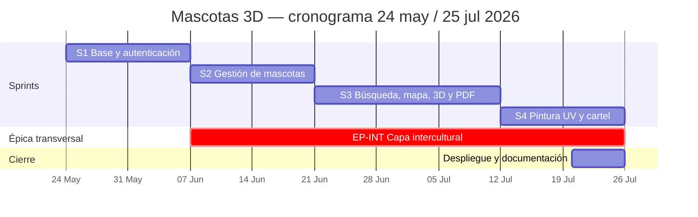

# 4. Evidencias del proceso de desarrollo

> Rúbrica §4: demostrar que el proyecto fue desarrollado aplicando un proceso
> organizado de Ingeniería de Software. No se califica una metodología
> específica; lo importante es evidenciar **planificación, seguimiento, control
> y evolución** del proyecto.

Marco aplicado: **Scrum**, adaptado a un proyecto académico con un responsable
técnico principal.

---

## 1. Cronograma real

**Período:** 24 de mayo de 2026 – 25 de julio de 2026 · **9 semanas** ·
**4 sprints** · semanas de domingo a sábado.

| Sprint | Fechas | Duración | Meta del sprint | Puntos |
| --- | --- | ---: | --- | ---: |
| **1** | 24 may – 6 jun | 2 sem | Base técnica y acceso seguro | 24 |
| **2** | 7 jun – 20 jun | 2 sem | Gestión de mascotas por propietario | 24 |
| **3** | 21 jun – 11 jul | 3 sem | Búsqueda, difusión y visualización 3D | 33 |
| **4** | 12 jul – 25 jul | 2 sem | Identificación visual, cartel y cierre | 37 |
| | | **9 sem** | | **118** |



> **Nota sobre la duración desigual del Sprint 3.** Se planificó de tres semanas
> porque concentraba cuatro integraciones externas simultáneas (Cloudinary,
> Leaflet, Three.js y jsPDF), cada una con riesgo propio. Extender el sprint fue
> preferible a arrastrar historias incompletas al siguiente.

## 2. Roles y responsabilidades

Al tratarse de un proyecto académico con un responsable principal, se documenta
una **adaptación** de los roles de Scrum. No se afirman reuniones ni
participantes que no hayan ocurrido.

| Responsabilidad Scrum | Cómo se cubrió |
| --- | --- |
| Product Owner | Responsable del proyecto, con retroalimentación del docente como stakeholder. Mantiene la visión y prioriza el backlog. |
| Scrum Master | Autogestión: seguimiento en bitácora, registro de impedimentos y retrospectiva escrita al cierre de cada sprint. |
| Developers | Diseño, implementación, pruebas y documentación. Responsable técnico: **Bryan Quispe**. |
| Stakeholders | Docente de la asignatura, evaluadores y usuarios de prueba. |

## 3. Product Backlog

Priorización con **MoSCoW**. Los puntos representan complejidad relativa, no
horas. El backlog completo con criterios de aceptación está en
[docs/Documentacion_Scrum_Mascotas3D/04_PRODUCT_BACKLOG.md](../../docs/Documentacion_Scrum_Mascotas3D/04_PRODUCT_BACKLOG.md).

### Resumen por sprint

| Sprint | Historias | Puntos | Foco |
| --- | --- | ---: | --- |
| 1 | HU-01 … HU-06 | 24 | Cuenta, sesión, JWT, roles, Prisma, interfaz adaptable |
| 2 | HU-07 … HU-12 | 24 | CRUD de mascotas, categorías, características, vista admin |
| 3 | HU-13 … HU-18 | 33 | Fotos, mapa, zona aproximada, catálogo 3D, visor, PDF |
| 4 | HU-19 … HU-25 | 37 | Modos separados, pintura UV, publicación, editor de cartel |
| Épica EP-INT | HU-26 … HU-31 | 21 | Capa intercultural kichwa–castellano (transversal S2–S4) |

### Épica transversal EP-INT — capa intercultural

Estas historias **no formaban parte del backlog original** y se incorporan aquí
porque sostienen el criterio de mayor peso de la evaluación. Se ejecutaron de
forma transversal: la arquitectura de internacionalización debe existir antes de
poder traducir pantallas, y cada pantalla se tradujo conforme se construía.

| ID | Historia | Prioridad | Puntos | Sprint | Estado |
| --- | --- | --- | ---: | ---: | --- |
| HU-26 | Como equipo quiero una arquitectura de traducción tipada, para que una clave inexistente falle en compilación. | Must | 5 | 2 | Completada |
| HU-27 | Como usuario kichwahablante quiero conmutar el idioma desde antes de iniciar sesión. | Must | 3 | 2 | Completada |
| HU-28 | Como usuario quiero que los datos ya guardados (color, tamaño, raza) se muestren en mi idioma. | Must | 5 | 3 | Completada |
| HU-29 | Como usuario quiero un modo bilingüe simultáneo `kichwa · castellano`. | Should | 3 | 4 | Completada |
| HU-30 | Como usuario quiero que el cartel PDF se genere en el idioma elegido. | Must | 3 | 4 | Completada |
| HU-31 | Como equipo quiero documentar cada término con su fuente lexicográfica. | Must | 2 | 4 | Completada |

## 4. Eventos Scrum y su evidencia

| Evento | Cadencia | Evidencia |
| --- | --- | --- |
| Sprint Planning | Inicio de cada sprint | Meta y Sprint Backlog — [sprint_pllanning.pdf](../../docs/sprint_pllanning.pdf), [09_sprint_planning.tex](../../docs/scrum/09_sprint_planning.tex) |
| Daily Scrum | Registro breve de avance | [daily_scrum.pdf](../../docs/daily_scrum.pdf), [10_daily_scrum.tex](../../docs/scrum/10_daily_scrum.tex) |
| Sprint Review | Cierre de sprint | [sprint_review.pdf](../../docs/sprint_review.pdf) |
| Sprint Retrospective | Cierre de sprint | [sprint_retrospective.pdf](../../docs/sprint_retrospective.pdf) |
| Incremento | Cierre de sprint | [incremento.pdf](../../docs/incremento.pdf), [14_incremento.tex](../../docs/scrum/14_incremento.tex) |

## 5. Definition of Ready y Definition of Done

**Definition of Ready** — una historia puede entrar a un sprint cuando expresa
actor, necesidad y beneficio; tiene criterios de aceptación comprobables;
identifica sus dependencias; tiene prioridad y estimación; es suficientemente
pequeña; y no depende de una decisión crítica sin resolver.

**Definition of Done** — una historia está terminada cuando:

- La implementación está integrada.
- TypeScript compila sin errores.
- Los permisos y validaciones relevantes funcionan.
- El flujo principal fue probado.
- La interfaz no presenta desbordamientos en escritorio ni móvil.
- No se exponen secretos ni la ubicación exacta.
- La documentación afectada fue actualizada.
- El incremento puede demostrarse desde la interfaz.

Documento formal: [13_definition_of_done.tex](../../docs/scrum/13_definition_of_done.tex).

## 6. Evolución del producto: adaptaciones registradas

Esta es la sección que mejor evidencia **control y evolución**, porque muestra
decisiones que cambiaron a partir de la inspección del incremento. Son casos
reales, verificables en el código actual.

| # | Situación detectada | Sprint | Decisión adoptada | Verificable en |
| --- | --- | ---: | --- | --- |
| A1 | La pintura sobre el modelo quedaba "flotando", desalineada de la superficie al rotar. | 4 | Reimplementar pintando sobre **coordenadas UV** de la textura en lugar de sobre el espacio de pantalla. | [Canvas3DViewer.tsx](../../frontend/src/components/Canvas3DViewer.tsx) |
| A2 | Rotar y pintar simultáneamente producía trazos accidentales. | 4 | Hacer los tres modos (Rotar / Zoom / Pintar) **mutuamente excluyentes**. | HU-19 |
| A3 | Pintar un modelo del catálogo degradaba el modelo para todos los usuarios. | 4 | Introducir el endpoint `POST /modelos3d/:id/derivar`: la edición crea una **copia propia** y no altera el original. | migración `20260725210000_add_modelo_derivado` |
| A4 | Publicar la dirección exacta exponía al propietario. | 3 | Separar ubicación interna de **zona pública aproximada**; excluir latitud y longitud del PDF. | HU-15 |
| A5 | El `API_SECRET` de Cloudinary no podía viajar al navegador. | 3 | Toda subida de imagen pasa por el backend (`POST /uploads/imagen`); el secreto nunca se expone como `NEXT_PUBLIC_*`. | [.env.example](../../backend/.env.example) |
| A6 | Las mascotas registradas antes de la traducción se mostraban solo en castellano. | 3 | `translateStored()` traduce en pantalla los valores de lista cerrada, **sin migrar la base de datos**. | [translations.ts](../../frontend/src/lib/i18n/translations.ts) |
| A7 | El servidor de desarrollo y la compilación de producción compartían `.next` y se corrompían mutuamente. | 4 | Separar el directorio de salida mediante `NEXT_DIST_DIR`. | [next.config.js](../../frontend/next.config.js) |
| A8 | Al desplegar, el frontend y el backend dejaron de compartir sistema de archivos. | Cierre | Derivar las URLs de los estáticos de `NEXT_PUBLIC_API_URL`; mover las imágenes de portada a `public/`. | [api.ts](../../frontend/src/lib/api.ts) |

Cada fila es una respuesta lista para la pregunta *"¿qué cambiaron durante el
desarrollo y por qué?"*, que es prácticamente segura en la defensa.

## 7. Nota sobre el historial de Git

**Hay que decir esto antes de que el tribunal lo descubra.**

El repositorio tiene 7 commits y **todos tienen fecha del 26 de julio de 2026**:

```
714f100  2026-07-26  first commit
654212c  2026-07-26  Configura ignorados y plantilla de entorno
f261dad  2026-07-26  Anade el backend NestJS con la API y los modelos 3D
628f8fa  2026-07-26  Anade el frontend Next.js bilingue kichwa-castellano
30b7ade  2026-07-26  Anade documentacion del proceso y respaldo de la traduccion
acb1784  2026-07-26  Amplia el registro y traduce las pantallas de autenticacion
3bae410  2026-07-26  Prepara el despliegue en Render y Vercel
```

El motivo es que el control de versiones se incorporó **al final** del proyecto:
el trabajo de los dos meses se desarrolló en local y se publicó de una sola vez.
El historial de Git, por tanto, **no es evidencia del proceso** en este proyecto.

### Cómo tratarlo

**Lo que no se debe hacer:** reescribir las fechas de los commits para simular
un historial de dos meses. Es trivial de detectar (los *committer dates* y el
reflog no coinciden con los *author dates*) y convierte un problema de proceso
en un problema de honestidad académica.

**Lo que sí se puede sostener:** el proceso está evidenciado por los otros
artefactos que la rúbrica acepta explícitamente —planificación, cronograma,
bitácoras, documentación generada, pruebas y mejoras implementadas—, y esos sí
existen y son abundantes: 15 documentos Scrum, 8 artefactos en PDF, ERS, casos
de uso, MER, informe de usabilidad y evaluación heurística.

**Respuesta preparada si preguntan:**

> "El repositorio se creó al final del proyecto, así que el historial de Git no
> refleja la cronología real: es una limitación del proceso que reconocemos. El
> seguimiento se llevó en la documentación Scrum, que sí está fechada por
> sprint. La lección aprendida, y la primera acción de mejora, es que el control
> de versiones debe iniciarse con el proyecto, no al entregarlo — no solo como
> evidencia, sino porque durante dos meses no tuvimos respaldo ni forma de
> revertir un cambio."

### Acción de mejora aplicable desde hoy

De aquí en adelante, un commit por cambio con mensaje descriptivo. Los tres
últimos commits ya siguen esa práctica y muestran el estándar deseado.

## 8. Retrospectiva del proyecto

| Qué funcionó | Qué no funcionó | Acción de mejora |
| --- | --- | --- |
| Dividir en incrementos demostrables mantuvo el producto siempre ejecutable. | El control de versiones se adoptó al final (§7). | Iniciar el repositorio con el primer commit del día 1. |
| Reemplazar la pintura flotante por pintura UV en lugar de parchearla. | La capa intercultural, que vale 3 de 7 puntos, no estaba en el backlog original. | Derivar el backlog de la rúbrica de evaluación, no solo de la visión del producto. |
| Separar zona pública de ubicación interna desde el diseño, no como parche. | El Sprint 3 requirió una semana extra por acumular cuatro integraciones. | Distribuir las integraciones externas en sprints distintos. |
| Documentar cada término kichwa con su fuente. | La traducción no fue validada por hablantes nativos. | Someter el glosario a revisión de un docente del SEIB. |
| Mantener los secretos fuera del frontend desde el inicio. | El despliegue se abordó al final y reveló supuestos de máquina local (A8). | Desplegar un esqueleto en la nube en el Sprint 1. |
