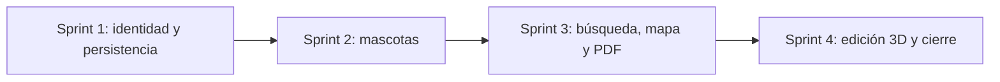

# Plan de entregas y métricas Scrum

## 1. Horizonte de entrega

El proyecto se organizó en cuatro sprints académicos ejecutados entre el **24 de mayo y el 25 de julio de 2026**, nueve semanas en total, con semanas de domingo a sábado.

| Sprint | Fechas | Duración | Meta | Puntos aceptados | Entrega principal |
| --- | --- | ---: | --- | ---: | --- |
| 1 | 24 may – 6 jun | 2 sem | Disponer de una base segura y persistente. | 24 | Autenticación, roles y arquitectura inicial. |
| 2 | 7 jun – 20 jun | 2 sem | Gestionar mascotas por propietario. | 24 | CRUD, categorías, características y administración. |
| 3 | 21 jun – 11 jul | 3 sem | Apoyar la búsqueda y difusión. | 33 | Fotos, mapa, catálogo 3D y PDF inicial. |
| 4 | 12 jul – 25 jul | 2 sem | Mejorar identificación y experiencia de exportación. | 37 | Pintura UV y editor completo de cartel. |

La épica transversal **EP-INT** (capa intercultural kichwa–castellano, 21 puntos, historias HU-26 a HU-31) atraviesa los sprints 2 a 4 y no se contabiliza en una iteración única.

El Sprint 3 duró una semana más que los demás porque concentraba cuatro integraciones externas simultáneas —Cloudinary, Leaflet, Three.js y jsPDF—, cada una con riesgo propio. Extenderlo fue preferible a arrastrar historias incompletas.

> Los puntos corresponden a estimación relativa aceptada según el backlog actual. No representan horas ni sustituyen registros reales de esfuerzo.

## 2. Release Goal

Entregar una aplicación web demostrable que permita a un propietario registrar una mascota perdida, asociar evidencia visual, proteger su ubicación exacta y producir un cartel listo para difusión.

## 3. Dependencias principales

## 4. Seguimiento

Para cada sprint se recomienda registrar:

- Puntos comprometidos y aceptados.
- Historias terminadas y trasladadas.
- Defectos encontrados antes y después de la Review.
- Impedimentos y tiempo de resolución.
- Acción de mejora acordada en la retrospectiva.

## 5. Interpretación de velocidad

La velocidad no debe utilizarse para comparar personas. Su valor es ayudar a prever cuánto trabajo similar puede aceptar el equipo. El crecimiento de los sprints 3 y 4 se explica por la incorporación de integraciones y por una división más detallada del backlog; no prueba por sí solo un aumento de productividad.

