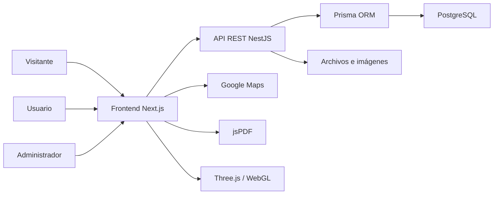
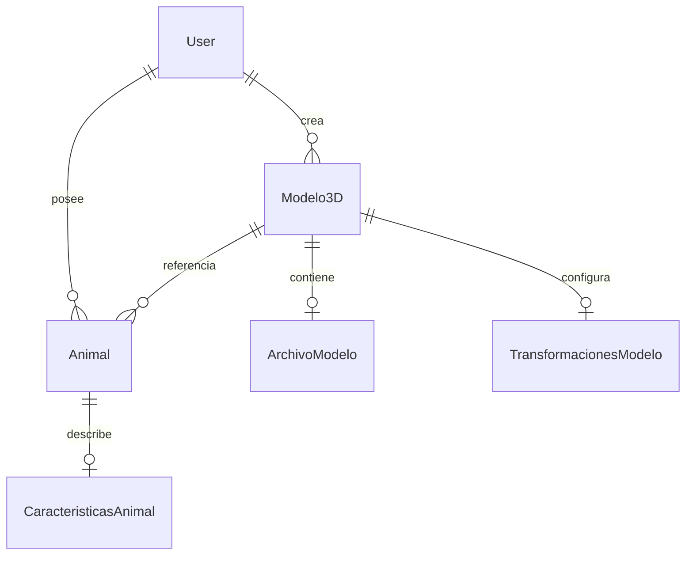
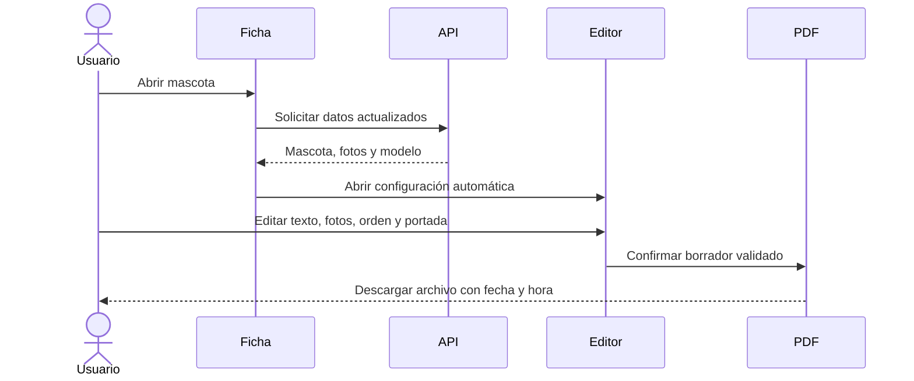

# Arquitectura y diseño técnico

## 1. Vista de contexto

## 2. Capas

| Capa | Responsabilidad | Componentes principales |
| --- | --- | --- |
| Presentación | Interacción, formularios, mapa, 3D y vista previa. | Next.js, React, Tailwind y Zustand |
| Comunicación | Consumo tipado de endpoints. | Axios y cliente `api.ts` |
| Aplicación | Casos de uso, permisos y validación. | Módulos NestJS |
| Dominio | Usuarios, mascotas, características y modelos. | Servicios y DTO |
| Persistencia | Relaciones y consultas. | Prisma y PostgreSQL |

## 3. Módulos backend

- `auth`: registro, login, bcrypt y JWT.
- `users`: perfil del usuario.
- `animales`: CRUD, propiedad, consulta pública y administración.
- `modelos3d`: catálogo, categoría, archivo, edición y visibilidad.
- `common`: Prisma, guards, decoradores y configuración transversal.

## 4. Componentes frontend relevantes

| Componente | Responsabilidad |
| --- | --- |
| `AddAnimalForm` | Registro y actualización de mascota. |
| `GoogleLocationInput` | Búsqueda, mapa, geocodificación y validación de Ecuador. |
| `ModelSelector` | Filtrado de modelos por categoría. |
| `Canvas3DViewer` | Carga de modelos, cámara, raycasting y pintura UV. |
| `EditModelForm` | Modos 3D, herramientas y publicación. |
| `PetPosterEditor` | Edición, selección de imágenes y vista previa A4. |
| `pet-report.ts` | Composición y descarga segura del PDF. |

## 5. Modelo de datos

## 6. Flujo de cartel

## 7. Decisiones técnicas

- La pintura se guarda como trazos UV para conservar el modelo base.
- Los modos de cámara y pintura son mutuamente excluyentes para evitar acciones accidentales.
- El PDF se genera en el navegador para ofrecer previsualización inmediata.
- El servidor conserva autorización y propiedad; la interfaz no es la única barrera.
- La ubicación exacta puede apoyar lógica interna, pero no se imprime en el cartel.

