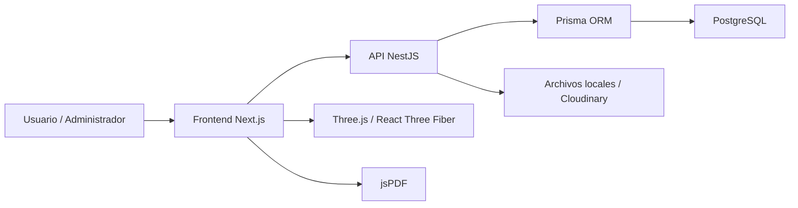

# Arquitectura del sistema

## Vista general

El sistema utiliza una arquitectura cliente-servidor separada en tres capas principales:

- **Frontend:** aplicacion web construida con Next.js, React y Tailwind CSS.
- **Backend:** API REST construida con NestJS.
- **Base de datos:** PostgreSQL gestionado mediante Prisma ORM.

## Diagrama de alto nivel

## Frontend

El frontend se encarga de la experiencia visual y de los flujos de usuario:

- Pantallas de inicio, login, registro y dashboard.
- Formularios para crear y editar mascotas.
- Visualizador 3D.
- Selector de categoria y modelos compatibles.
- Vista de detalle de mascota.
- Exportacion PDF desde el navegador.

### Librerias principales del frontend

| Libreria | Uso |
| --- | --- |
| Next.js | Framework principal para la aplicacion web. |
| React | Construccion de componentes interactivos. |
| Tailwind CSS | Estilos y responsividad. |
| Axios | Consumo de la API REST. |
| Three.js | Renderizado 3D en navegador. |
| React Three Fiber | Integracion declarativa de Three.js con React. |
| Drei | Controles y utilidades para escenas 3D. |
| jsPDF | Generacion del cartel o ficha PDF. |
| Zustand | Manejo ligero de estado cuando se requiere. |

## Backend

El backend centraliza la logica de negocio:

- Autenticacion y roles.
- Gestion de usuarios.
- Gestion de mascotas.
- Gestion y carga de modelos 3D.
- Validaciones.
- Persistencia mediante Prisma.
- Exposicion de endpoints REST.

### Modulos principales del backend

| Modulo | Responsabilidad |
| --- | --- |
| `auth` | Registro, login y generacion de JWT. |
| `users` | Perfil y datos del usuario. |
| `animales` | CRUD de mascotas y vistas publicas. |
| `modelos3d` | Catalogo, carga, edicion y relacion de modelos 3D. |
| `common/prisma` | Conexion centralizada a PostgreSQL. |
| `common/guards` | Proteccion por JWT y roles. |

## Base de datos

La base de datos se define con Prisma. Las entidades principales son:

| Entidad | Descripcion |
| --- | --- |
| `User` | Guarda usuarios, rol, zona y relacion con mascotas/modelos. |
| `Animal` | Representa una mascota registrada y asociada a un dueno. |
| `CaracteristicasAnimal` | Guarda tamano, color y habitat de la mascota. |
| `Modelo3D` | Guarda datos del modelo, categoria, color, pinturas y visibilidad. |
| `ArchivoModelo` | Guarda informacion del archivo 3D. |
| `TransformacionesModelo` | Guarda escala, rotacion y posicion del modelo. |

## Flujo principal de datos

1. El usuario inicia sesion.
2. El frontend guarda el token y consume la API.
3. El usuario crea una mascota.
4. El backend valida datos y la asocia al usuario autenticado.
5. El usuario selecciona categoria.
6. El sistema filtra modelos 3D compatibles.
7. El usuario carga fotos y registra zona aproximada.
8. La informacion se guarda en PostgreSQL.
9. El usuario abre la ficha de la mascota.
10. El frontend captura la escena 3D y genera un PDF con jsPDF.

## Seguridad y privacidad

- Las rutas privadas requieren JWT.
- Los roles permiten diferenciar usuario comun y administrador.
- Las mascotas pertenecen a un usuario.
- La ubicacion exacta no debe mostrarse publicamente.
- La ficha PDF prioriza zona aproximada y telefono de contacto.

## Decisiones tecnicas defendibles

- **NestJS:** permite organizar el backend por modulos y controladores.
- **Prisma:** reduce errores al trabajar con base de datos mediante tipado.
- **Next.js:** facilita construir una interfaz moderna y modular.
- **Three.js:** es una libreria reconocida para renderizado 3D web.
- **jsPDF:** permite generar documentos exportables sin depender del servidor.
- **PostgreSQL:** base relacional adecuada para usuarios, mascotas y relaciones.
